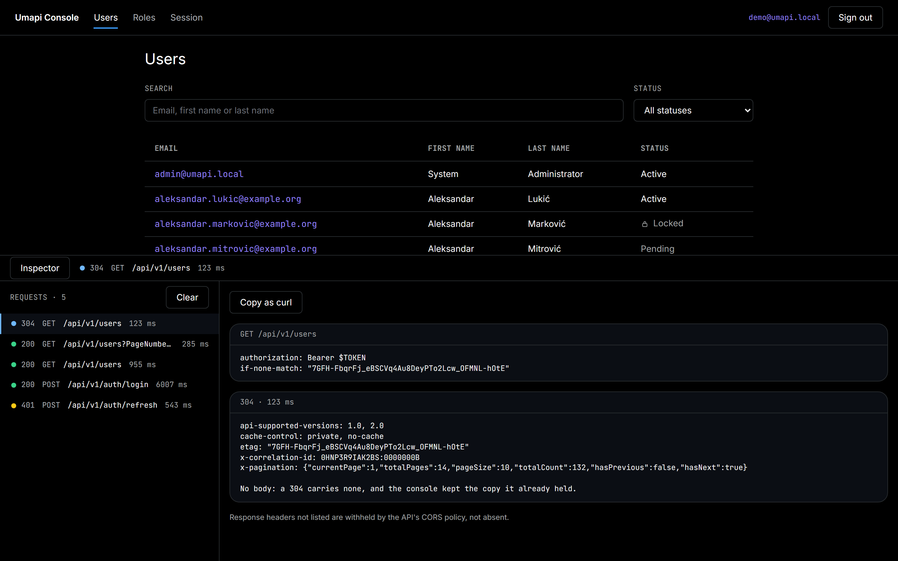
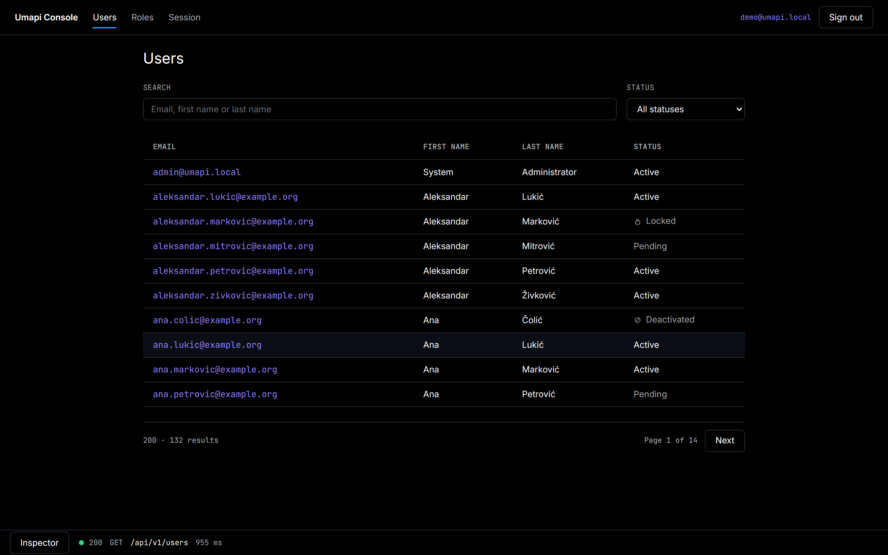
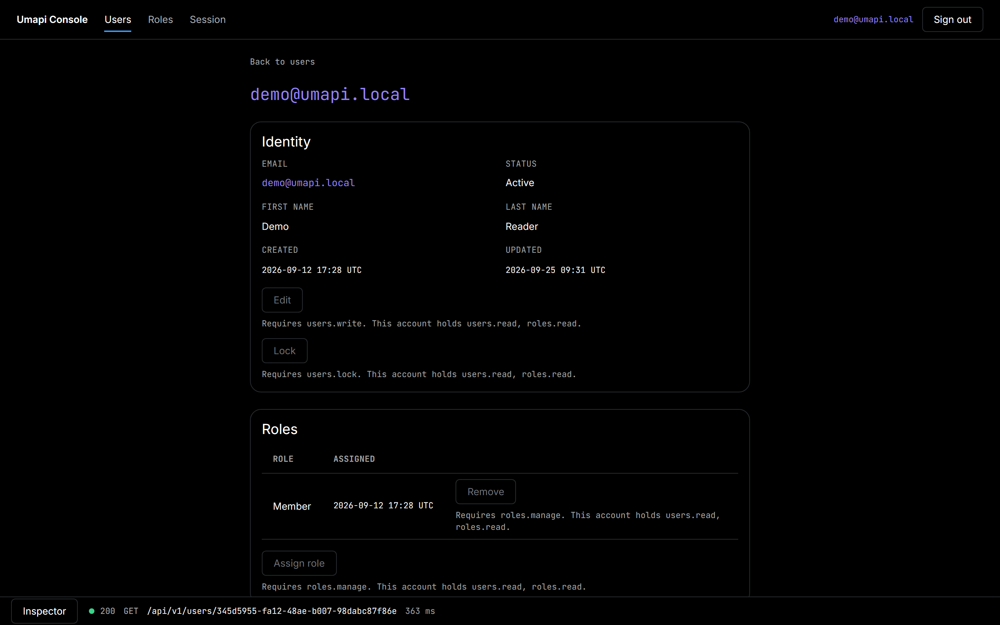
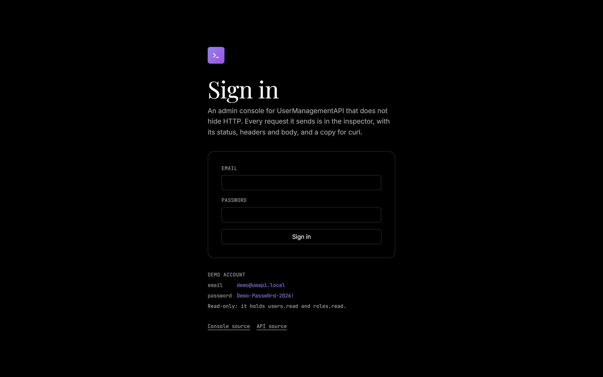
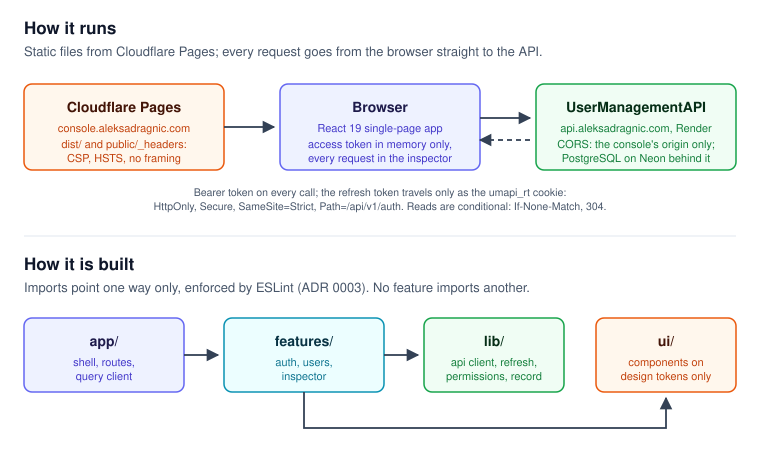

# Umapi Console

[](https://github.com/aleksa-dragnic/Umapi-Console/actions/workflows/ci.yml)
[](https://react.dev/)
[](LICENSE)

An admin console for [UserManagementAPI](https://github.com/aleksa-dragnic/UserManagementAPI)
that does not hide HTTP. Every request it sends is in the inspector, with its
status, headers and body, and a copy for curl; a 304 says 304, a refused write
says which permission it needed, and a cold start says the API is waking. It
runs against the live API at **https://console.aleksadragnic.com**, signed in
with a published read-only account.

It is a personal project built to a production standard, the front end of a
pair whose back end is the API above.



## Live demo

**https://console.aleksadragnic.com**, as the demo account the sign-in screen
prints:

|          |                       |
| -------- | --------------------- |
| email    | `demo@umapi.local`    |
| password | `Demo-Passw0rd-2026!` |

The account holds `users.read` and `roles.read`. Every write is shown, disabled,
with the permission it needs; the API would refuse it anyway.

- **The API sleeps.** It runs on a free instance that stops after fifteen
  minutes without traffic. The first visit after that shows "Waking the API"
  for up to a minute; nothing is wrong.
- **The account is shared.** Everyone signed in as the demo account holds a
  session of the same user. The Session screen's refresh race is real and asks
  for confirmation first: if the API reads it as a reused refresh token, it
  revokes every session of the account, every visitor's included.
- **Login, refresh and logout share ten requests a minute per IP.** Past that
  the API answers 429 and the console says when to try again.

## What it shows

| Screen      | What it makes visible                                                                                                                                         |
| ----------- | ------------------------------------------------------------------------------------------------------------------------------------------------------------- |
| Sign in     | The boot refresh that restores a session from the cookie alone; the cold-start state; a refusal in the one wording the API allows                             |
| Users       | Search, status filter, sort and page held in the URL; every read conditional, so returning to a page answers 304                                              |
| User detail | Identity, status and roles; each write gated by the permission it needs, with the reason written under it; the record's ETag                                  |
| Roles       | Roles and the permissions each one grants                                                                                                                     |
| Session     | The access token's claims, the permissions read from them, and a race of two refreshes against one cookie                                                     |
| Inspector   | Every request at the transport: method, path, status, timing, request and response headers, body, Copy as curl. The token is written as `$TOKEN`, never shown |

<table>
  <tr>
    <td></td>
    <td></td>
  </tr>
  <tr>
    <td></td>
    <td></td>
  </tr>
</table>

## Architecture



- **No server of its own.** Cloudflare Pages serves the static build; the
  browser talks to the API directly. The API's CORS allows this origin only,
  and the refresh cookie needs the same site, so a copy served from anywhere
  else cannot sign in.
- **Tokens.** The access token lives in memory and is never written to
  storage. The refresh token never reaches JavaScript: it travels as an
  `HttpOnly`, `SameSite=Strict` cookie on `/api/v1/auth` only. A 401 triggers
  one refresh, shared by every request waiting on it
  ([ADR 0007](docs/adr/0007-refresh-token-in-an-httponly-cookie.md),
  [ADR 0008](docs/adr/0008-single-flight-refresh.md)).
- **Permissions** come from the token's claims, the same ones the API checks
  ([ADR 0009](docs/adr/0009-permissions-from-claims.md)).
- **Types** are generated from the API's OpenAPI document; the `contract` job
  in CI fails when the committed copy drifts from the live one
  ([ADR 0006](docs/adr/0006-generated-api-types.md)).
- **Server state** goes through TanStack Query, with conditional reads; the
  directory's state lives in the URL, and there is no state library
  ([ADR 0010](docs/adr/0010-server-state-through-tanstack-query.md),
  [ADR 0011](docs/adr/0011-no-state-library-and-collection-state-in-the-url.md)).
- **Security headers** come from `public/_headers`: a Content Security Policy
  that allows scripts and styles from the console itself and connections to the
  API alone, HSTS, and no framing
  ([ADR 0015](docs/adr/0015-the-console-sends-its-own-security-headers.md)).

## Tech stack

| Area         | Choice                                                                                                |
| ------------ | ----------------------------------------------------------------------------------------------------- |
| Language     | TypeScript 5.9, strict                                                                                |
| UI           | React 19 with the React Compiler, React Router 8 (declarative)                                        |
| Server state | TanStack Query 5, `openapi-fetch` on types from `openapi-typescript`                                  |
| Styling      | Tailwind CSS 4 on two tiers of design tokens; Inter, Playfair Display and JetBrains Mono, self-hosted |
| Build        | Vite 8, pnpm 12, Node 24                                                                              |
| Tests        | Vitest 5 and Testing Library; Playwright 1.63 with axe; MSW 2 for the mock API                        |
| Hosting      | Cloudflare Pages, with headers from `public/_headers`                                                 |

## Running it

```bash
git clone https://github.com/aleksa-dragnic/Umapi-Console.git
cd Umapi-Console
pnpm install
pnpm dev
```

`pnpm dev` starts the console on http://localhost:5173 against a mock of the
API that runs in the browser, so nothing else is needed; it signs in with the
same demo account. To run it against a local API instead, start the API (its
README has the steps) and set two variables first:

```bash
VITE_API_BASE_URL=http://localhost:5085 VITE_API_MODE=live pnpm dev
```

Use `localhost`, not `127.0.0.1`: the refresh cookie belongs to the site, and
the two are different sites.

## Testing

| Layer              | Command           | What runs                                                                                                              | At v1.0.0                        |
| ------------------ | ----------------- | ---------------------------------------------------------------------------------------------------------------------- | -------------------------------- |
| Unit and component | `pnpm test:run`   | Vitest in jsdom, against the mock                                                                                      | 386 tests in 52 files            |
| End to end         | `pnpm test:e2e`   | Playwright on a production build with the mock, axe on every screen, dialog and the inspector                          | 18 tests in 8 specs              |
| Contract           | CI job `contract` | the committed API types compared with the live OpenAPI document                                                        | weekly and on every pull request |
| Live               | `pnpm test:live`  | Playwright against the deployed console and API: one auth cycle, the directory, the read-only boundary, the cold start | 3 tests, by hand only            |

`build-and-test` and `e2e` are required on every pull request. The live suite
never runs in CI: it depends on a free instance waking, shares the demo account
with every visitor, and spends nine of the auth limit's ten requests a minute.

## Documentation

- [`docs/adr/`](docs/adr/README.md) - fifteen architecture decision records.
- [`docs/BUILD-PLAN.md`](docs/BUILD-PLAN.md) - the plan, its invariants and,
  in section 14, every place the build departed from it.
- [`docs/SCREEN-INVENTORY.md`](docs/SCREEN-INVENTORY.md) - every screen and
  state, with its copy.
- [`docs/DESIGN-DECISIONS.md`](docs/DESIGN-DECISIONS.md) and
  [`docs/tokens.css`](docs/tokens.css) - the visual system.
- [`docs/OBSERVED-BEHAVIOUR.md`](docs/OBSERVED-BEHAVIOUR.md) - what the API was
  measured to do, row by row; the console is written from these rows, not from
  the OpenAPI document alone.

## Known limits

- **Narrow screens scroll.** Layout was checked by hand at 380px; tables scroll
  sideways there rather than wrap. No test covers narrow viewports.
- **The ETag is shown, not enforced.** The API does not check versions on
  writes, so the last save wins; the detail screen says so.
- **A run of 429s on the Session screen's race** reads as "unexpected" without
  the countdown the rest of the console shows.
- **A refused or unanswered sign-out** leaves the cookie valid, so a reload
  restores the session.
- **Preview deploys cannot sign in.** Pages previews live on `*.pages.dev`,
  another site, outside the API's CORS list.
- **The mock sends no `X-Correlation-Id`**; the inspector shows it against the
  API only.

## License

[MIT](LICENSE).
